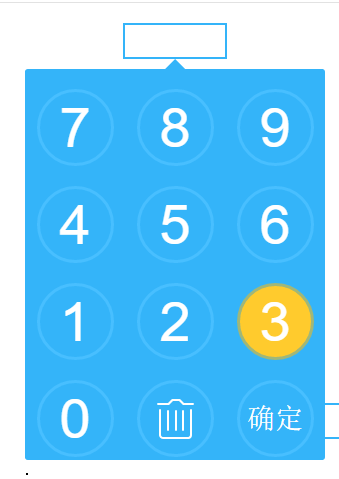

# number-softkeyboard  数字控件使用说明
number softkeyboard input widgets
##引用控件css文件、js文件
```
<link rel="stylesheet" href="../css/softkeyboard.css" />
<script type="text/javascript" src="../js/jquery-2.1.4.min.js"></script>
<script src="../js/softkeyboard.js"></script>
```
##html代码
```
<body>
	<input id="ipt1" type="text"  />
	<input id="ipt2" type="text"  />
	<input id="ipt3" type="text"  />
</body>
```

##对要使用的元素进行初始化
```
jQuery("#ipt1,#ipt2,#ipt3").softKeyboard();
```

##效果图  
   效果图一：  
   